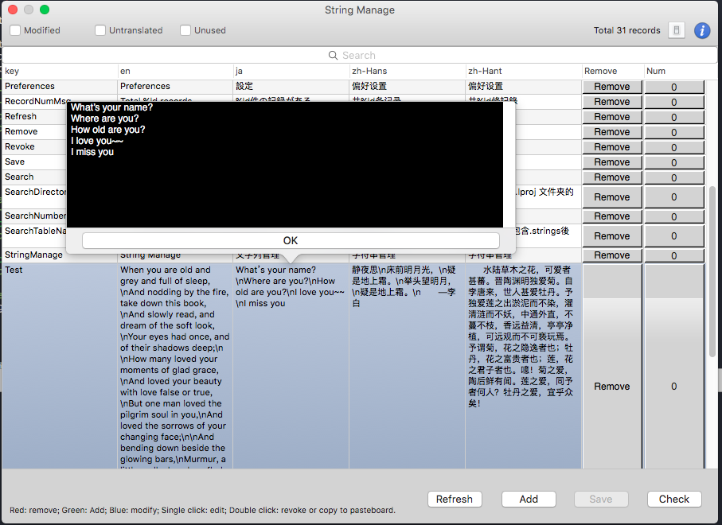
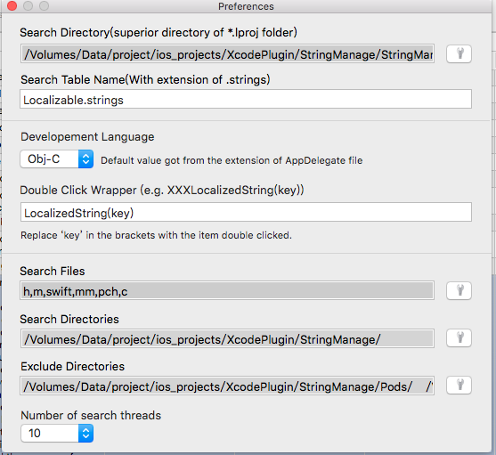

## StringManage -- Xcode plugin

A Xcode plugin for managing strings in your projects

### What can StringManage do?

- show all the strings in Localizable.strings
- add/remove/search strings
- check every string is used or not and jump to the referenced line

### Install
clone this repo, Build the project and it's done!

### Usage

Open any project and use <kbd>ctrl</kbd>+<kbd>shift</kbd>+<kbd>s</kbd> to trigger the StringManage Window on/off

